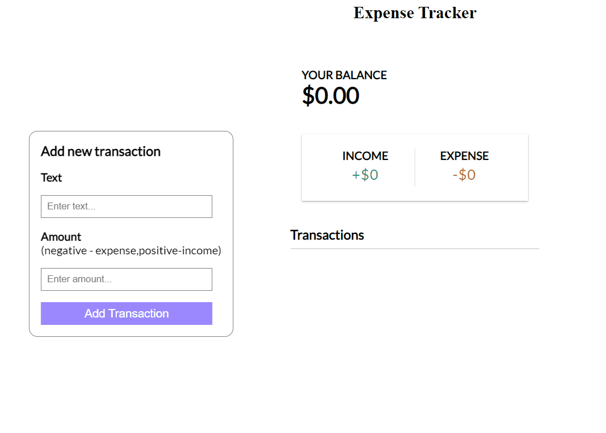

# ExpenseTracker


## Overview
This application helps users manage their expenses effortlessly by allowing them to add, edit, and delete transactions.


## Features:

- Add new expenses with text and amount

- Edit existing expenses with pre-filled forms

- Delete unwanted expenses

- Display a summary of expenses

### Technologies Used
[](https://skillicons.dev)
- **React.js**: For building the user interface

- **useReducer Hook**: For managing complex state logic

- **useState Hook**: For managing local component state

- **useEffect Hook**: For handling side effects and form field focus

- **CSS Modules**: For styling the components

- **React Refs (useRef)**: For accessing and manipulating DOM elements directly


## Installation

To run this project locally, follow these steps:

1. Clone the repository:

   ```bash
   git clone https://github.com/MdIrfan-ul/ExpenseTracker.git
   ```
2. Navigate to the Project Directory:
```bash
   cd ExpenseTracker
   ```
   
3. Install Dependencies:

 ```bash
     npm install
 ```

4. Start the development server:

```bash
npm start
```
5. Open your browser and navigate to http://localhost:3000 to view the application.

## Usage
This application helps users manage their day to day expenses effortlessly by allowing them to add, edit, and delete transactions.